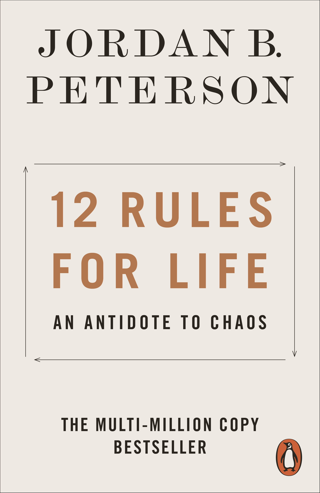
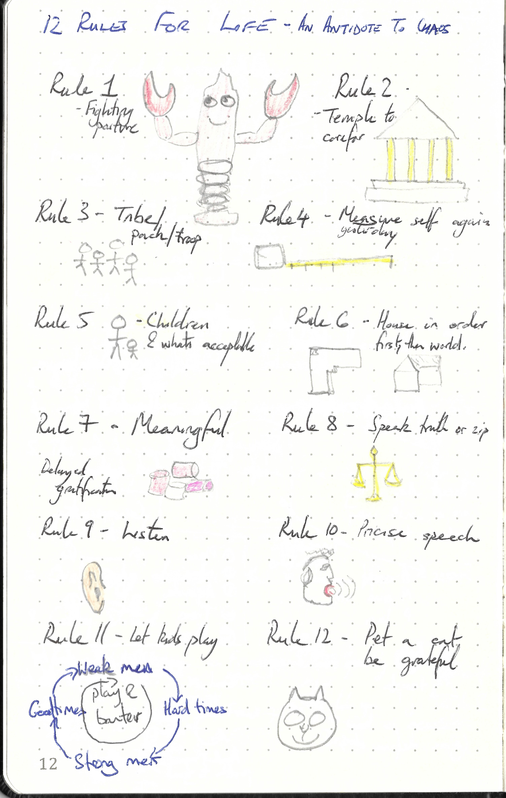

This repository is dedicated to

---

> 12 Rules for Life, an antidote to chaos by Jordon Peterson
>
> ISBN :- 978-0-241-35163-5
>
> First  Edition

---

The books "Table of Content"  represents the task list.

- [x] Rule 1 - Stand up straight with your shoulders back
- [x] Rule 2 - Treat yourself like someone you are responsible for helping
- [x] Rule 3 - Make friends with people who want the best for you
- [x] Rule 4 - Compare yourself to who you were yesterday, not to who someone else is today
- [x] Rule 5 - Do not let your children do anything that makes you dislike them
- [x] Rule 6 - Set your house in perfect order before you criticize the world
- [x] Rule 7 - Pursue what is meaningful (not what is expedient)
- [x] Rule 8 - Tell the truth - or at least don't lie
- [x] Rule 9 - Assume that the person you are listening to might know something you don't
- [x] Rule 10 - Be precise in your speeh
- [x] Rule 11 - Do not bother children when they are skateboarding
- [x] Rule 12 - Pet a cat when you encouter one on the street
- [ ] Coda

This book does not contain exercises, it is simply informative. Therefore a summary of what I thought relevant is given below. 

