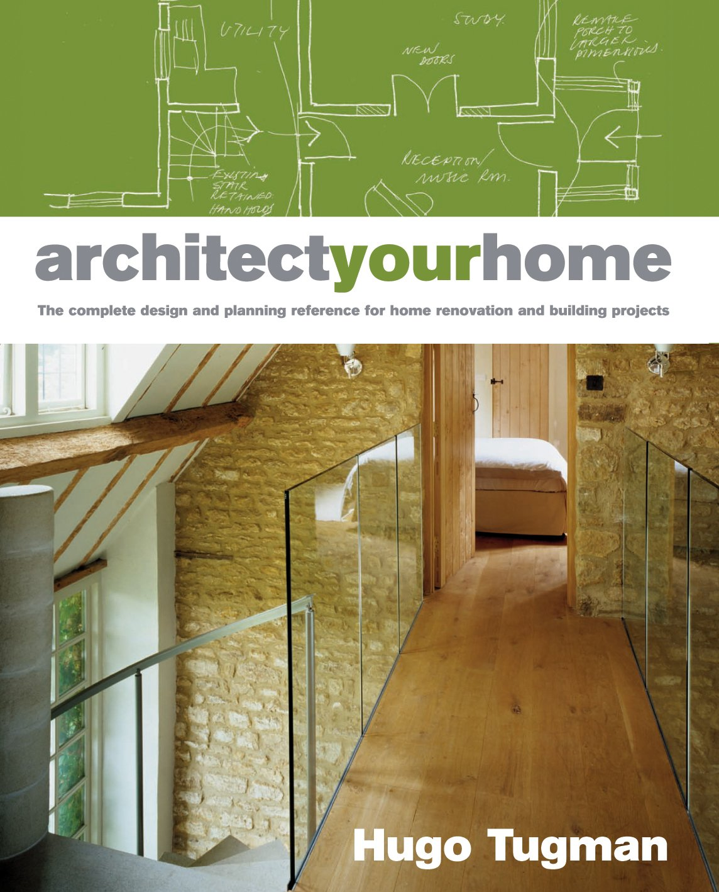
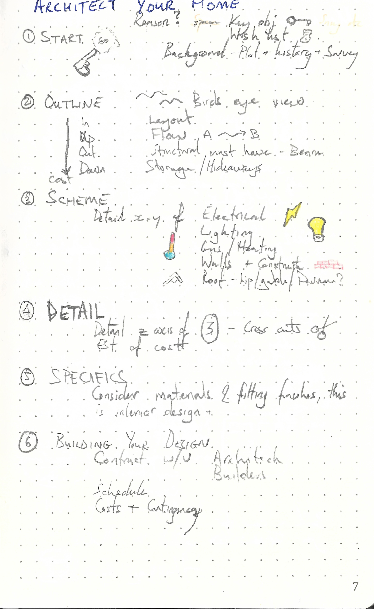

This repository is dedicated to

---

> architectyourhome by Hugo Tugman
>
> ISBN :- 978-1-84340-474-3
>
> First  Edition

---

The books "Table of Content"  represents the task list.

- [x] 1. Starting point
- [x] 2. Outline design
- [x] 3. Scheme design
- [x] 4. Detailed design
- [x] 5. Specification
- [x] 6. Building your design

This book does not contain exercises, it is simply informative. Therefore a summary of what I thought relevant is given below. Note on outline-costs, arrow used to indicate increase in cost as you go from inside building to down (most expensive)

