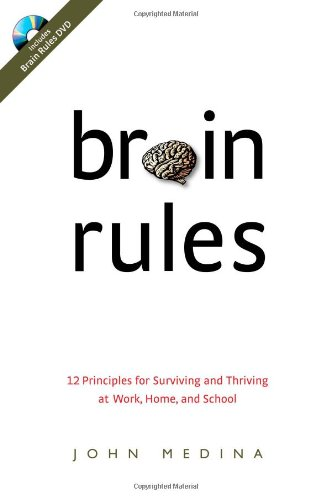
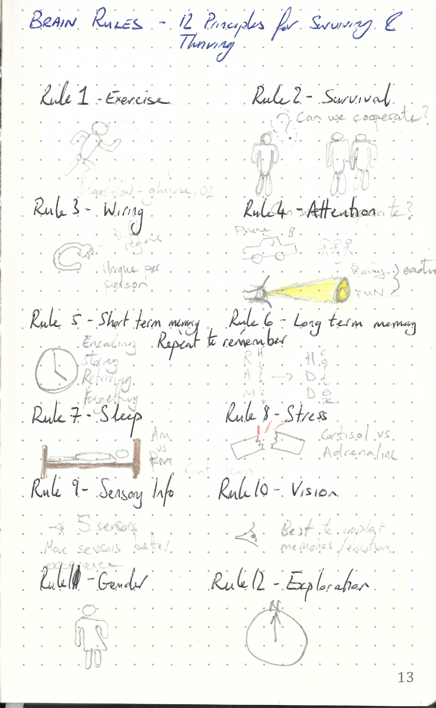

This repository is dedicated to

---

> Brain Rules: 12 Principles for Surviving and Thriving at Work, Home, and School by John Medina
>
> ISBN :- 978-0-9797777-0-7
>
> First Edition

---

The books "Table of Content"  represents the task list.

- [x] Exercise - Rule#1 : Exercise boosts brain power
- [x] Survival - Rule#2 : The human brain evolved, too
- [x] Wiring - Rule#3 : Every brain is wired differently
- [x] Attention - Rule#4 : We don't pay attention to boring things
- [x] Short-term Memory - Rule#5 : Repeat to remember.
- [x] Long-term Memory - Rule#6 : Remember to repeat
- [x] Sleep - Rule#7 : Sleep well, think well
- [x] Stress - Rule#8 : Stressed brains don't learn the same way
- [x] Sensory integration - Rule#9 : Stimulate more of the senses
- [x] Vision - Rule#10: Vision trumps all other senses
- [x] Gender - Rule#11: Male and female brains are different
- [x] Exploration - Rule#12: We are powerful and natural explorers

This book does not contain exercises, it is simply informative. Therefore a summary of what I thought relevant is given below. 

