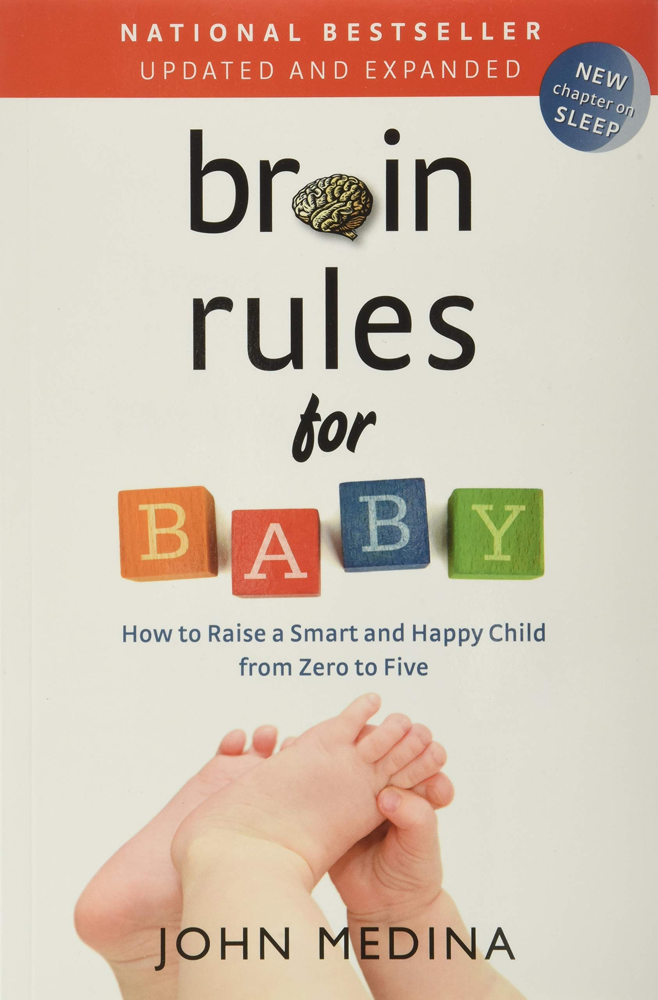
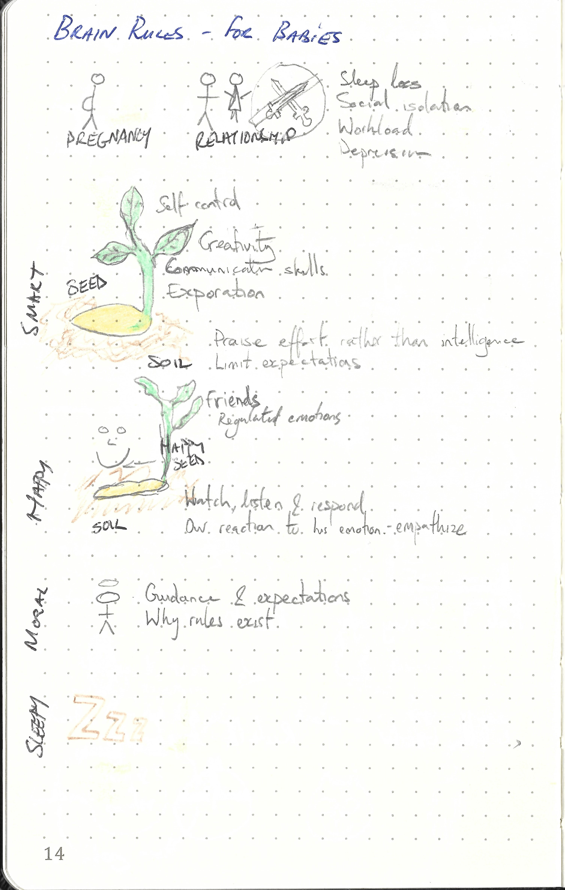

This repository is dedicated to

---

> Brain Rules for Baby: How to Raise a Smart and Happy Child from Zero to Five by John Medina
>
> ISBN :- 978-0-9832633-8-8
>
> First Edition

---

The books "Table of Content"  represents the task list.

- [x] Introduction
- [x] Pregnancy
- [x] Relationship
- [x] Smart baby : seeds
- [x] Smart baby : soil
- [x] Happy baby : seeds
- [x] Happy baby : soil
- [x] Moral baby
- [x] Sleepy baby
- [x] Conclusion
- [x] Practical tips

This book does not contain exercises, it is simply informative. Therefore a summary of what I thought relevant is given below. 

