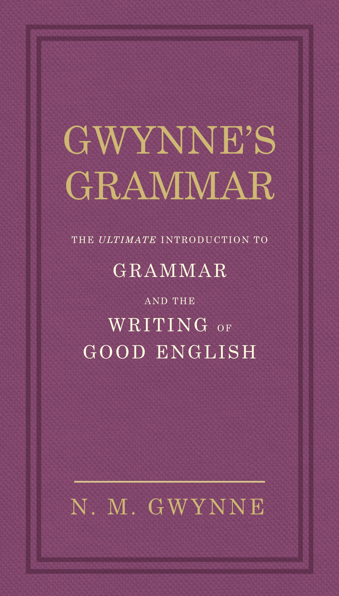
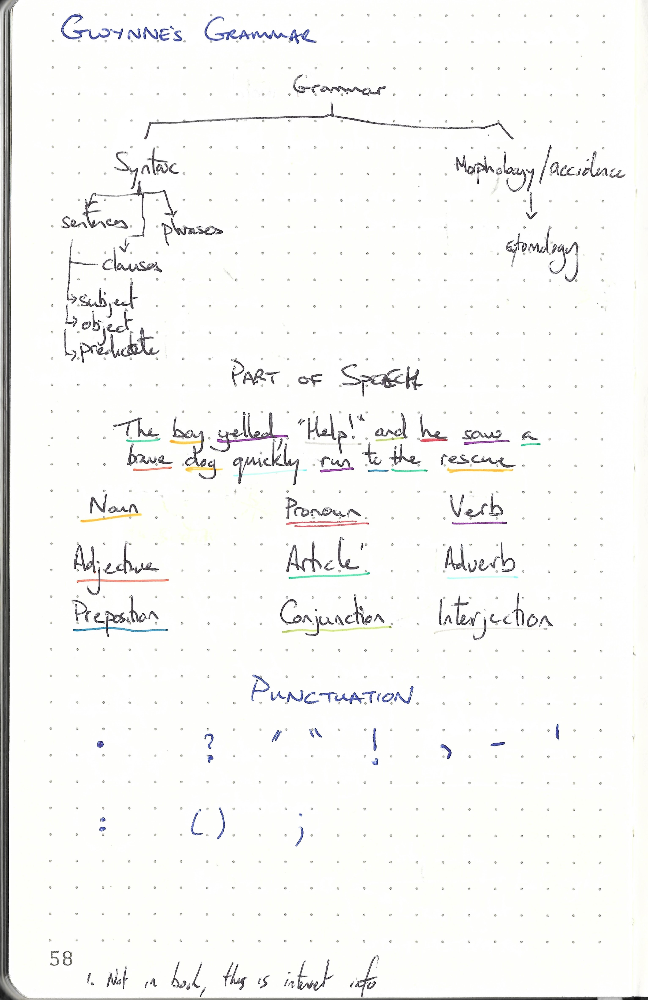

This repository is dedicated to

---

> Gwynne's Grammar by N.M.Gwynne
>
> ISBN :- 978-0091951450
>
> First Edition

---

The books "Table of Content"  represents the task list.

- [x] Part one : Gwynne's Grammar
    - [x] This is a serious business
    - [x] A not of encouragement
    - [x] Further Encouragement
    - [x] Still Introductory
    - [x] Parts of speech
    - [x] The most important syntax basics
    - [x] Punctuation
    - [x] Putting what is being learnt into practice
- [x] Part two : Strunks on style
    - [x] Intro
    - [x] Elementary rules of usage
    - [x] Elementary principles of composition
    - [x] A few matters of form
    - [x] Words and expressions commonly misused

This book does not contain exercises, it is simply informative. Therefore a summary of what I thought relevant is given below. 

