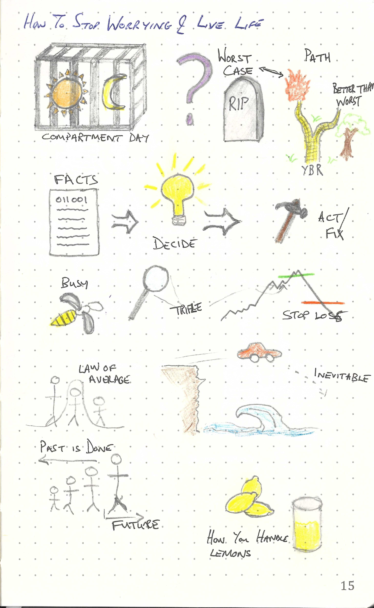
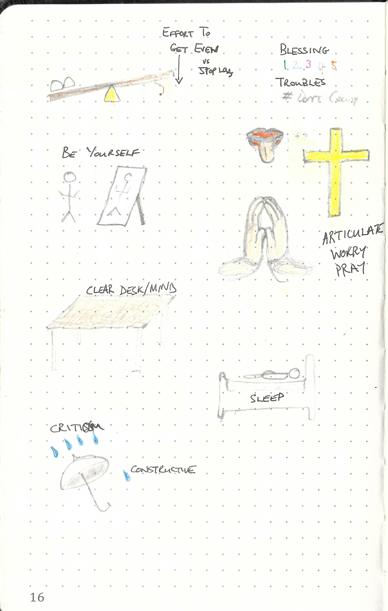

This repository is dedicated to

---

> How to Stop Worrying and Starting Living by Dale Carnegie
>
> ISBN :- 978-0-74-930723-3
>
> 1993rd Edition

---

The books "Table of Content"  represents the task list.

- [x] Part One - FUNDAMENTAL FACTS YOU SHOULD KNOW ABOUT WORRY
    - [x] Life in 'Day-tight Compartments'
    - [x] A Magic Formular for Solving Worry Situations
    - [x] What Worry May Do to You
- [x] Part Two - BASIC TECHNIQUES IN ANALYZING WORRY
    - [x] How to Analyze and Solve Worry Problems
    - [x] How to Eliminate Fifty Per Cent of Your Business Worries
- [x] Part Three - HOW TO BREAK THE WORRY HABIT BEFORE IT BREAKS YOU 
    - [x] How to Crowd Worry Out of your Mind
    - [x] Don't Let the Beetles Get You Down
    - [x] A Law That Will Outlaw Many of Your Worries
    - [x] Co-operate with the Inevitable
    - [x] Put a 'Stop-Loss' Order on Your Worries
    - [x] Don't Try to Saw Sawdust
- [x] Part Four - SEVEN WAYS TO CULTIVATE A MENTAL ATTITUDE THAT WILL BRING YOU PEACE AND HAPPINESS
    - [x] Eight Words That Can Transform Your Life
    - [x] The High Cost of Getting Even (I'm married... I know)
    - [x] If You Do This, You Will Never Worry About Ingratitude
    - [x] Would You Take a Million Dollars for What You Have?
    - [x] Find Yourself and Be Yourself: Remember There is No One Else on Earth Like You
    - [x] If You Have a Lemon, Make Leomonade (subtle are of giving a fuck says suck it up)
    - [x] How to Cure Depression in Fourteen Days
- [x] Part Five - THE PERFECT WAY TO CONQUER WORRY
    - [x] How My Mother and Father Conquered Worry
- [x] Part Six - HOW TO KEEP FROM WORRYING ABOUT CRITICISM
    - [x] Remember That No One Ever Kicks a Dead Dog
    - [x] Do This - and Criticism Can't Hurt You
    - [x] Fool Things I Have Done
- [x] Part Seven - SIX WAYS TO PREVENT FATIGUE AND WORRY AND KEEP YOU ENERGY AND SPIRIT HIGH
    - [x] How to Add One Hour a Day to Your Waking Life
    - [x] What Makes You Tired - and What You Can Do About it
    - [x] How to Avoid Fatigue - and Keep Looking Young!
    - [x] Four Good Working Habits That Will Help Prevent Fatigue and Worry
    - [x] How to Banish the Boredom That Produces Fatigue, Worry and Resentment
    - [x] How to Keep from Worrying About Insomnia
- [x] Part Eight - 'HOW I CONQUERED WORRY'
    - [x] Collection of letters, not listed but all read

This book does not contain exercises, it is simply informative. Therefore a summary of what I thought relevant is given below. 

