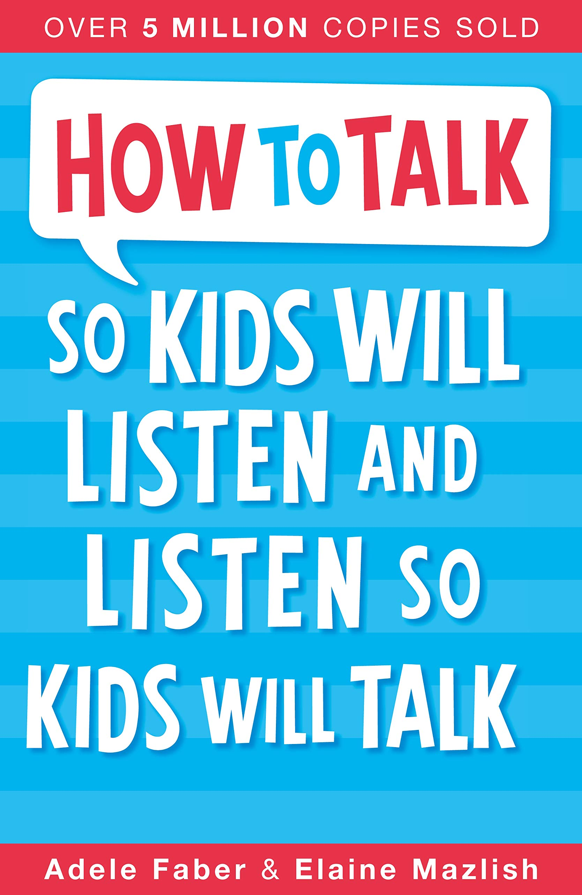
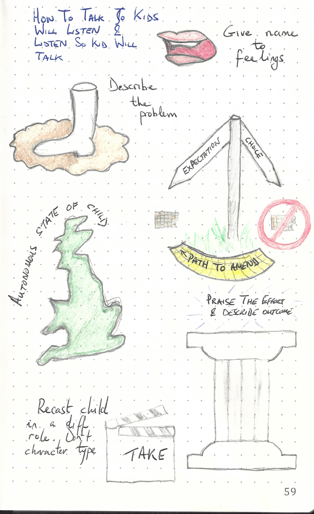

This repository is dedicated to

---

> How to talk to kids so they listen and how to listen so kids talk
>
> ISBN :- 978-1-84812-341-0
>
> 30th Anniversary Edition

---

The books "Table of Content"  represents the task list.

- [x] 1. Helping Children Deal with their Feelings
- [x] 2. Engaging Cooperation
- [x] 3. Alternatives to Punishment
- [x] 4. Encouraging Autonomy
- [x] 5. Praise
- [x] 6. Freeing Children from Playing Roles
- [x] 7. Putting it all Together
- [ ] What's it all about, anyway?
- [ ] Afterword
- [ ] Many Years Later
- [ ] I. The letters
- [ ] II. Yes, but ... what if ... how about ...?
- [ ] III. Their Native Tongue
- [ ] Rule 12 - Pet a cat when you encouter one on the street
- [ ] 30th Anniversary
- [ ] The Next Generation
- [x] Some Books you may Find Interesting

This book does not contain exercises, it is simply informative. Therefore a summary of what I thought relevant is given below. 

