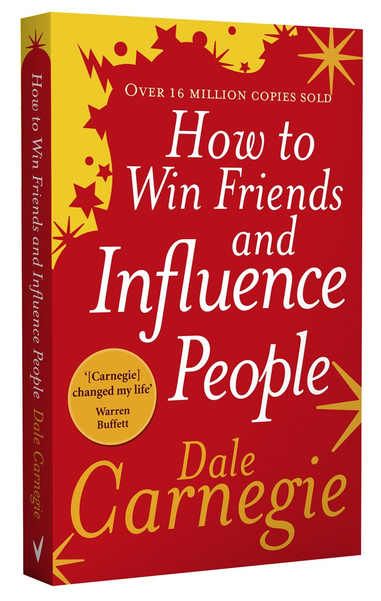
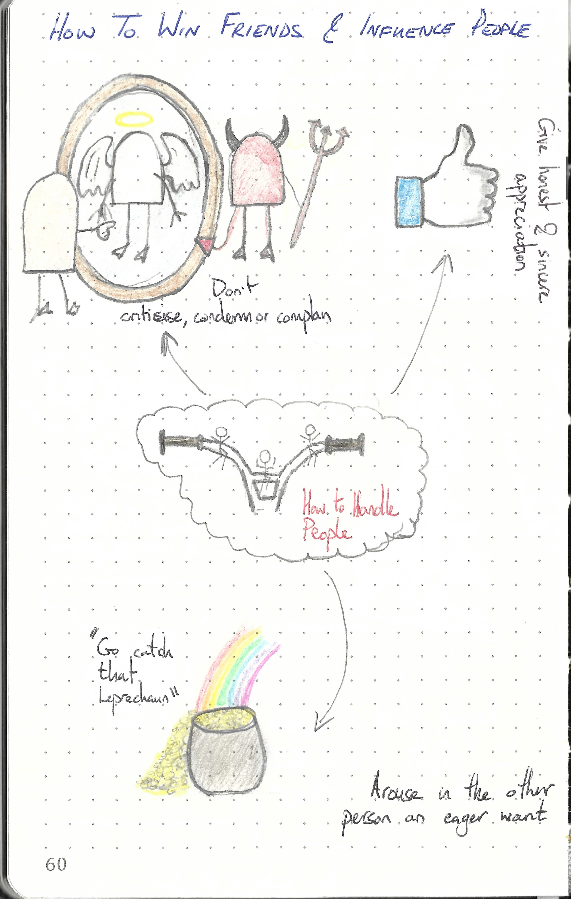
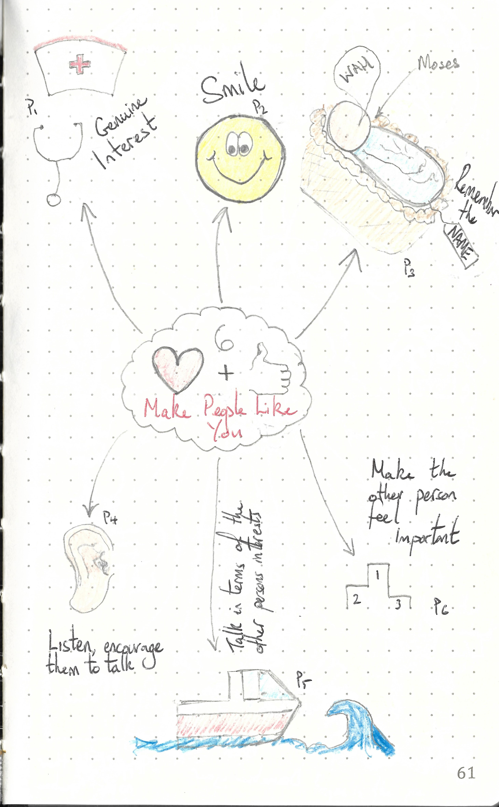
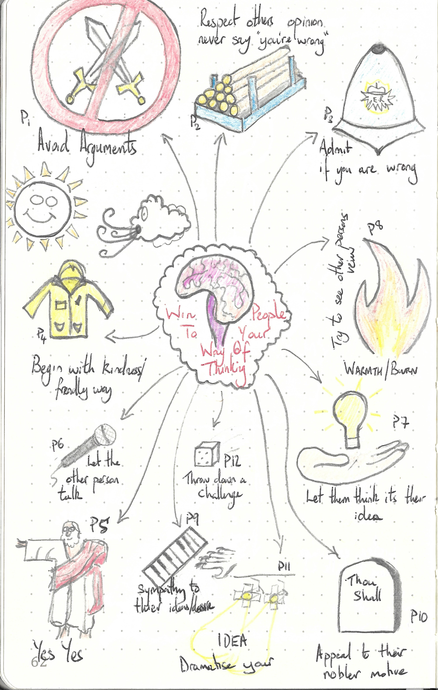
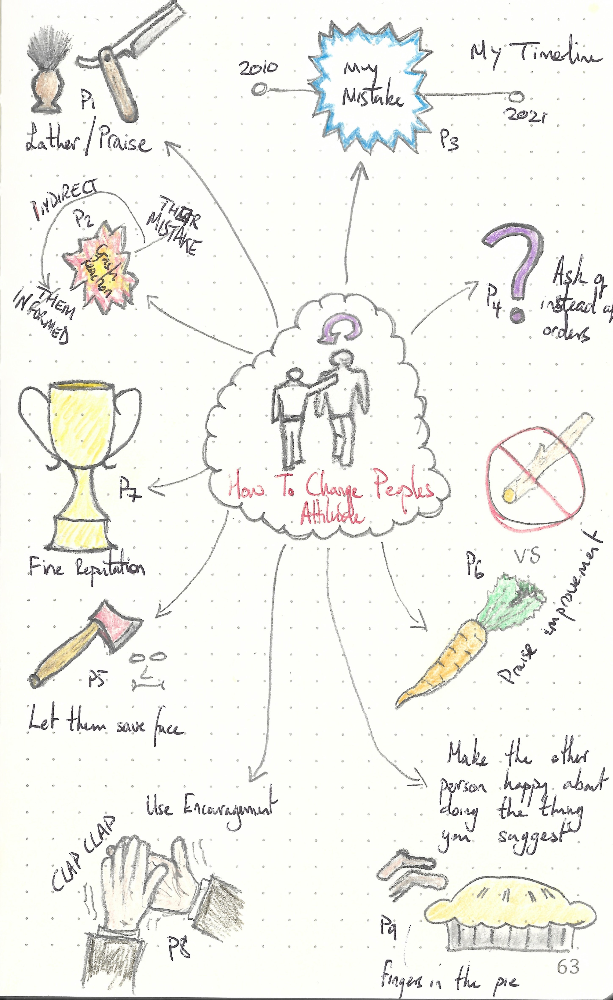

This repository is dedicated to

---

> How to Stop Worrying and Starting Living by Dale Carnegie
>
> ISBN :- 978-0091906818
>
> 2006 Edition

---

The books "Table of Content"  represents the task list.

- [x] Part One: Fundamental techniques in handling people
    - [x] If you want to gather honey, don't kick over the beehive
    - [x] The big secret of dealing with people
    - [x] He who can do htis has the whole world in him. He who cannot walks a lonely way
- [x] Part Two: Six ways to make people like you
    - [x] Do this and you'll be welcome anywhere
    - [x] A simple way to make a good first impression
    - [x] If you don't do this, you are headed for trouble
    - [x] An easy way to become a good conversationalist
    - [x] How to interest people
    - [x] How to make people like you instantly
- [x] Part Three: How to win people to your way of thinking 
    - [ ] You can't win an arguement
    - [x] A sure way of making enemies - and how to avoid it
    - [x] If you'r wrong, admit it
    - [x] A drop of honey
    - [x] The secret of Socrates
    - [x] The safety valve in handling commplaints
    - [x] How to get cooperation
    - [x] A formula that will work wonders for you
    - [x] What everybod wants
    - [x] An appeal that everybody likes
    - [x] The movies do it. TV does it. Why dont you do it?
    - [x] When nothing else works, try this
- [x] Part Four: Be a leader: How to change people without gibing offence or arousing resentment
    - [x] If you must find fault, this is the best way to begin
    - [x] How to criticise and not be hated for it
    - [x] Talk about your own mistakes first
    - [x] No one like to take orders 
    - [x] Let the other person save face
    - [x] How to spur people on to success
    - [x] Give a dog a good name
    - [x] Make the fault seem easy to correct
    - [x] Making people glad to do what you want

This book does not contain exercises, it is simply informative. Therefore a summary of what I thought relevant is given below. 

