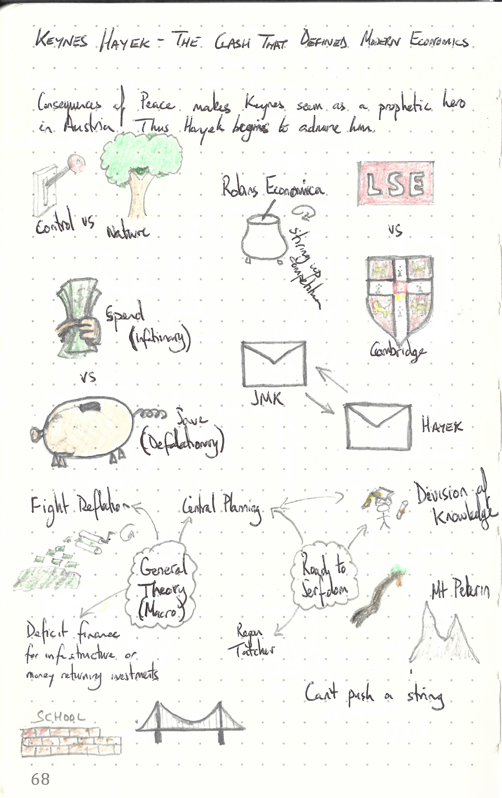

This repository is dedicated to

---

> Keynes Hayek: The Clash That Defined Modern Economics
>
> ISBN :- 978-0393343632
>
> First Edition

---

The books "Table of Content"  represents the task list.

- [x] The Glamorous Hero
- [x] End of Empire
- [x] The Battle Lines Are Drawn
- [x] Stanley and Livingstone
- [x] The Man Who Shot Liberty Valance
- [x] Pistols at Dawn
- [x] Return Fire
- [x] The Italian Job
- [x] Toward The General Theory
- [x] Hayek Blinks
- [x] Keynes Takes America
- [x] Hopelessly Stuck in Chapter 6
- [x] The Road to Nowhere
- [x] The Wilderness Years
- [x] The Age of Keynes
- [x] Hayek's Counterrevolution
- [x] The Battle Resumed
- [x] And the Winner is ....

This book does not contain exercises, it is simply informative. Therefore a summary of what I thought relevant is given below. 

