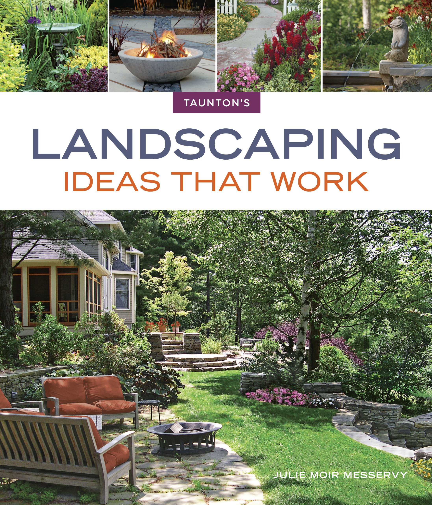
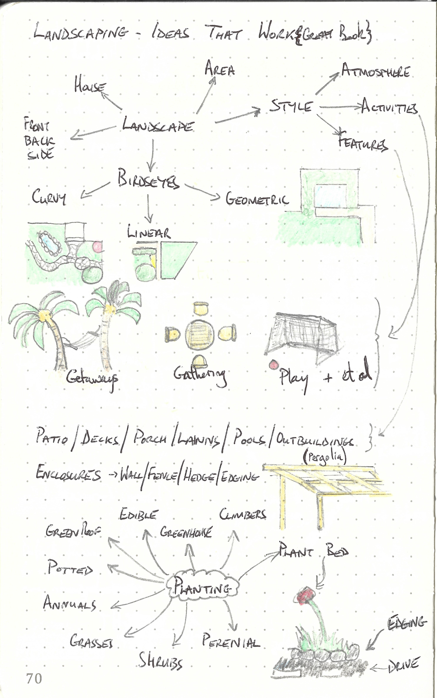

This repository is dedicated to

---

> Landscaping Ideas that Work
>
> ISBN :- 978-1600857805
>
> First Edition

---

The books "Table of Content"  represents the task list.

- [x] Designing Your Landscape
- [x] Spaces That Work
- [x] Open-Air Rooms
- [x] Walls, Fences, and Hedges
- [x] Paths and Walkways
- [x] Planting
- [x] Details in the Landscapes

This book does not contain exercises, it is simply informative. Therefore a summary of what I thought relevant is given below. 

