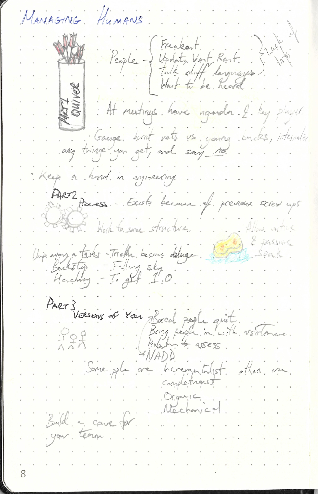

This repository is dedicated to

---

> Managing Humans By Michael Loop
>
> ISBN :-  978-1484221570
>
> Third Edition

---

The books "Table of Content"  represents the task list.

- [x] Part 1: The Management Quiver
  - [x] Don't be a prick ...(rest of sub section not included)
- [x] Part 2: The Process is the Product
  - [x] 1.0 ...(rest of sub section not included)
- [x] Part 3: Versions of You
  - [x] Bored People Quit ...(rest of sub section not included)

This book does not contain exercises, it is simply informative. Therefore a summary of what I thought relevant is given below. 

