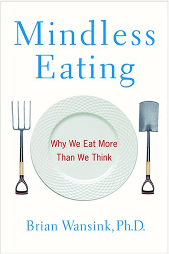

This repository is dedicated to

---

> Mindless Eating: Why We Eat More Than We Think By Brian Wansink
>
> ISBN :- 978-0-553-80434-8
>
> First Edition

---

The books "Table of Content"  represents the task list.

- [x] The Science of Snacking
- [x] The Mindless Margin
- [x] The Forgotten Food
- [x] Surverying the Tablescape
- [x] The Hidden Persauders Arround Us
- [x] Mindless Eating Scripts
- [x] The New Game
- [x] In the Mood for Comfort Food
- [x] Nutritional Gatekeepers
- [x] Fast Food Fever
- [x] Mindlessly Eating Better

This book does not contain exercises, it is simply informative. Therefore a summary of what I thought relevant is given below. 

