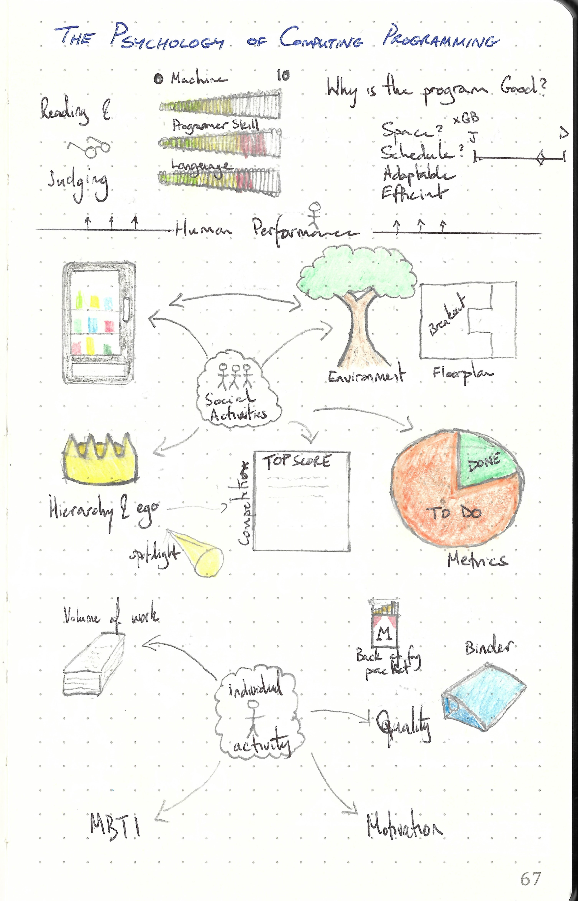

This repository is dedicated to

---

> The Psychology of Computer Programming
>
> ISBN :- 978-0932633422
>
> Silver Anniversary Edition

---

The books "Table of Content"  represents the task list.

- [x] Programming as Human Performance
  - [x] Reading Programs
  - [x] What Makes a Good Program?
  - [x] How Can We Study Programming
- [x] Programming as a Social Activity
  - [x] The Programming Group
  - [x] The Programming Team
  - [x] The Programming Project
- [x] Programming as an Individual Activity
  - [x] Variations In The Programming Task
  - [x] Personality Factors
  - [x] Intelligence, or Problem-Solving Ability
  - [x] Motivation, Training and Experience
- [x] Programming Tools
  - [x] Programming Languages
  - [x] Some Principles For Programming Language Design
  - [x] Other Programming Tools

This book does not contain exercises, it is simply informative. Therefore a summary of what I thought relevant is given below. 

