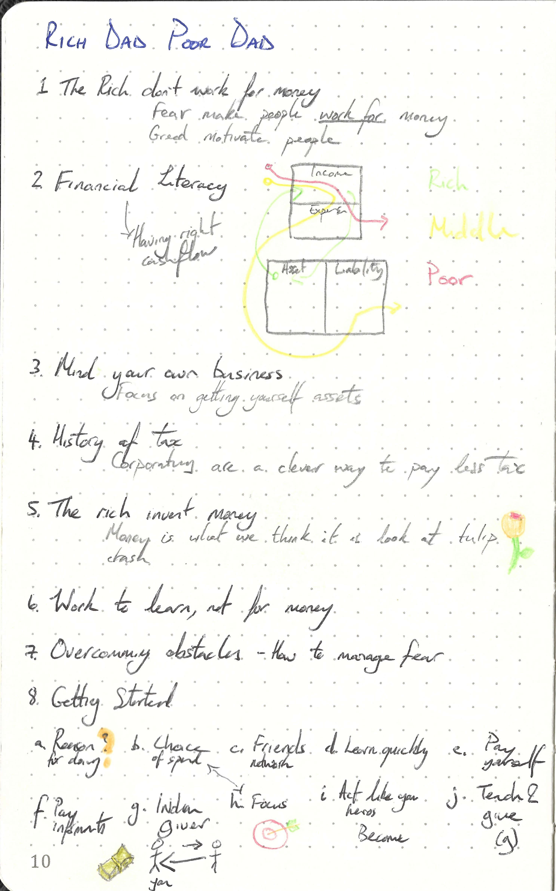

This repository is dedicated to

---

> Rich Dad Poor Dad by Robert T.Kiyosaki
>
> ISBN :- 978-1612680194
>
> Second Edition

---

The books "Table of Content"  represents the task list.

- [x] Lesson 1 : The Rich Don't Work for Money
- [x] Lesson 2 : Why Teach Financial Literacy
- [x] Lesson 3 : Mind Your Own Business
- [x] Lesson 4 : The History of Taxes and the Power of Corporations
- [x] Lesson 5 : The Rich Invent Money
- [x] Lesson 6 : Work to Learn - Won't Work for Money
- [x] Overcoming Obstacles
- [x] Getting Started
- [x] Still Want More? Here Are Some To Do's
- [x] Final Thoughts

This book does not contain exercises, it is simply informative. Therefore a summary of what I thought relevant is given below. 

