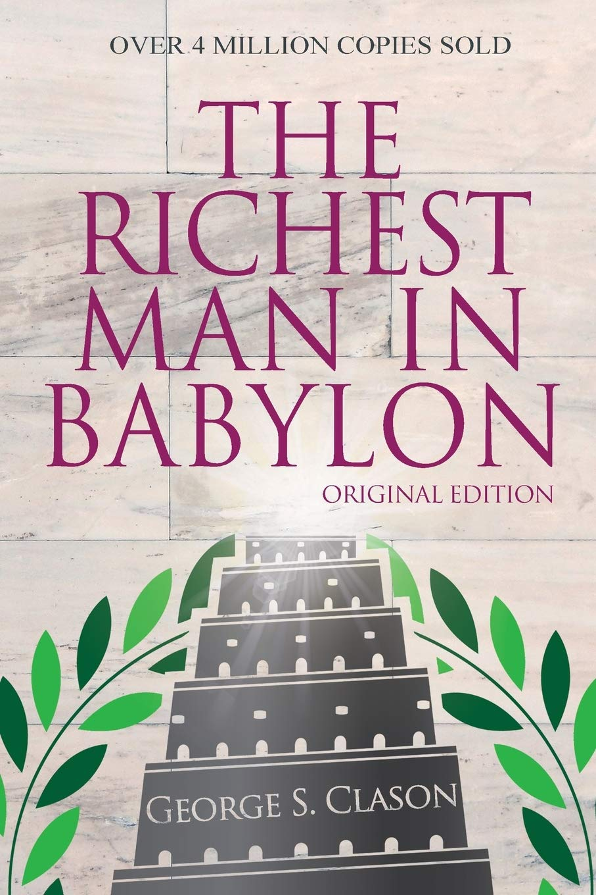
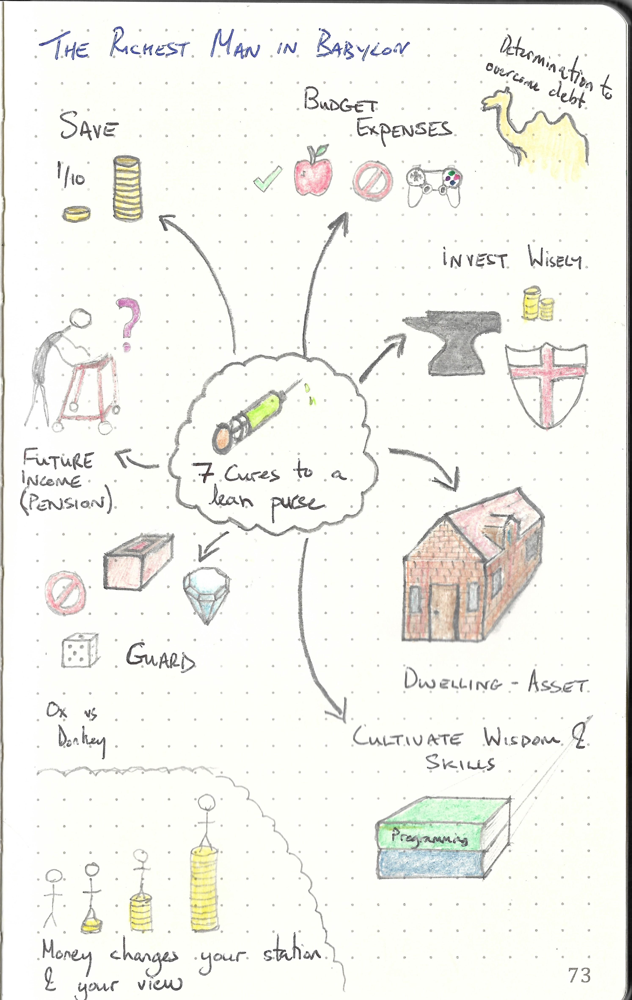

This repository is dedicated to

---

> The Richest Man in Babylon
>
> ISBN :- 978-1939438638
>
> First Edition

---

The books "Table of Content"  represents the task list.

- [x] The Man Who Desired Gold
- [x] The Richest Man in Babylon
- [x] Seven Cures for a Lean Purse
- [x] Meet the Goddess of Good Luck
- [x] The Five Laws of Gold
- [x] The Gold Lender of Babylon
- [x] The Walls of Babylon
- [x] The Camel Trader of Babylon
- [x] The Clay Tablets From Babylon
- [x] The Luckiest Man in Babylon
- [x] An Historical Sketch of Babylon

This book does not contain exercises, it is simply informative. Therefore a summary of what I thought relevant is given below. 

