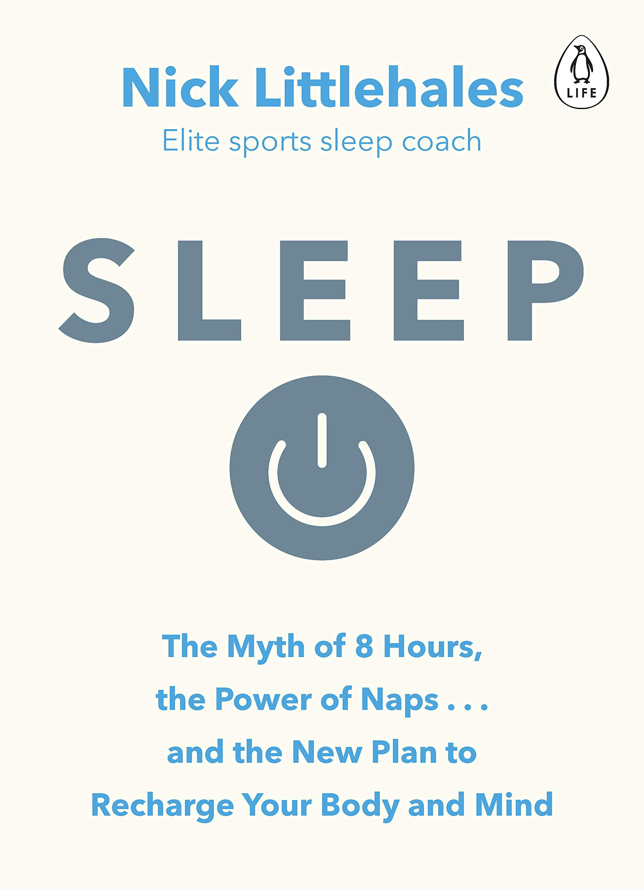
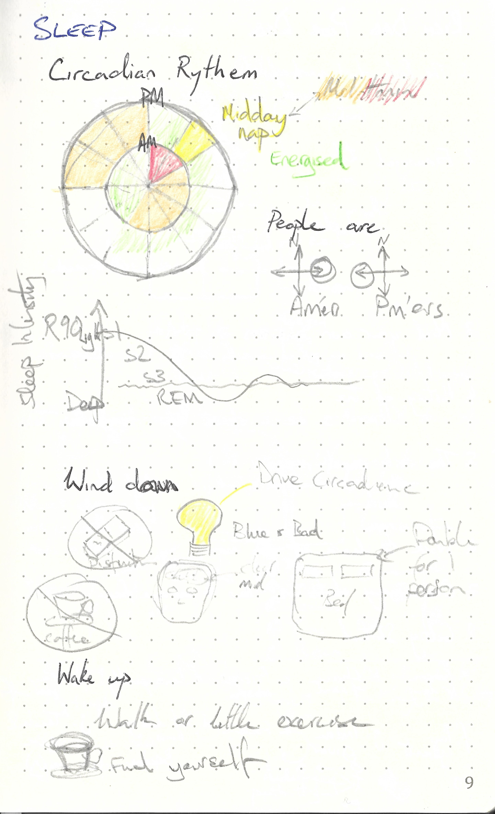

This repository is dedicated to

---

> Sleep: Change the way you sleep with this 90 minute read by Nick Littlehales
>
> ISBN :- 978-0241975978
>
> First Edition

---

The books "Table of Content"  represents the task list.

- [x] Part one : The Key Sleep Recovery Indicator
    - [x] The Clock is Ticking - Circadian Rhythms
    - [x] Running Fast and Slow - Chronotypes
    - [x] A Game of Ninety Minutes - Sleeping in Cycles, Not Hours
    - [x] Warming Up and Cooling Down - Pre and Post sleep Routines
    - [x] Time Out! - Redfining Naps
    - [x] The Sleep Kit - Reinventing the Bed
    - [x] Recovery Room - The Sleeping Environment
- [x] Part two : R90 In Action
    - [x] A Head Start - Using R90 Recovery Program
    - [x] Sleeping with the Enemy - Sleep Problems
    - [x] The Home Team - Sex, Partners and the Modern Family
- [x] Your Personal Best

This book does not contain exercises, it is simply informative. Therefore a summary of what I thought relevant is given below. 

