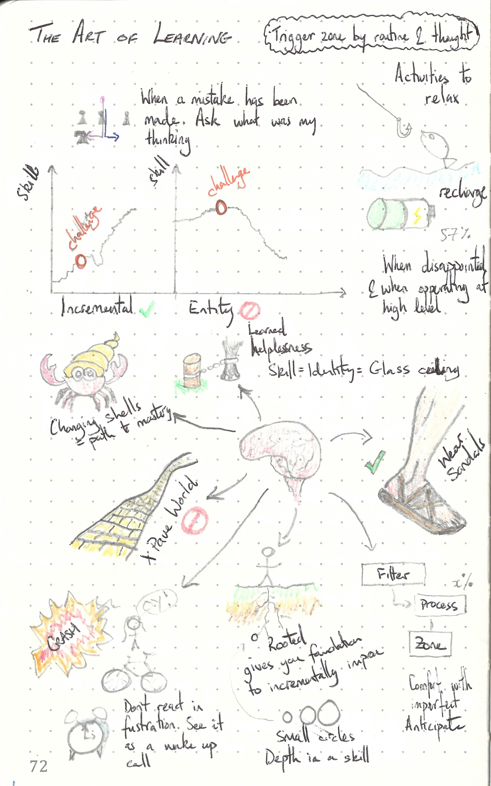

This repository is dedicated to

---

> The Art of Learning by Josh Waitzkin
>
> ISBN :- 978-0743277464
>
> First Edition

---

The books "Table of Content"  represents the task list.

- [x] The Foundation
  - [x] Innocent Moves
  - [x] Losing to Win
  - [x] Two Approaches to Learning
  - [x] Loving the Game
  - [x] The Soft Zone
  - [x] The Downward Spirals
  - [x] Changing Voice
  - [x] Breaking Stallions
- [x] My Second Art
  - [x] Beginner's Mind
  - [x] Investment in Lost
  - [x] Making Smaller Circles
  - [x] Using Adversity
  - [x] Slowing Down Time
  - [x] The Illusion of the Mystical
- [x] Bringing it all Together
  - [x] The Power of Presence
  - [x] Searching for the Zone
  - [x] Building Your Trigger
  - [x] Making Sandals
  - [x] Bringing it All Together
  - [x] Taiwan

This book does not contain exercises, it is simply informative. Therefore a summary of what I thought relevant is given below. 

