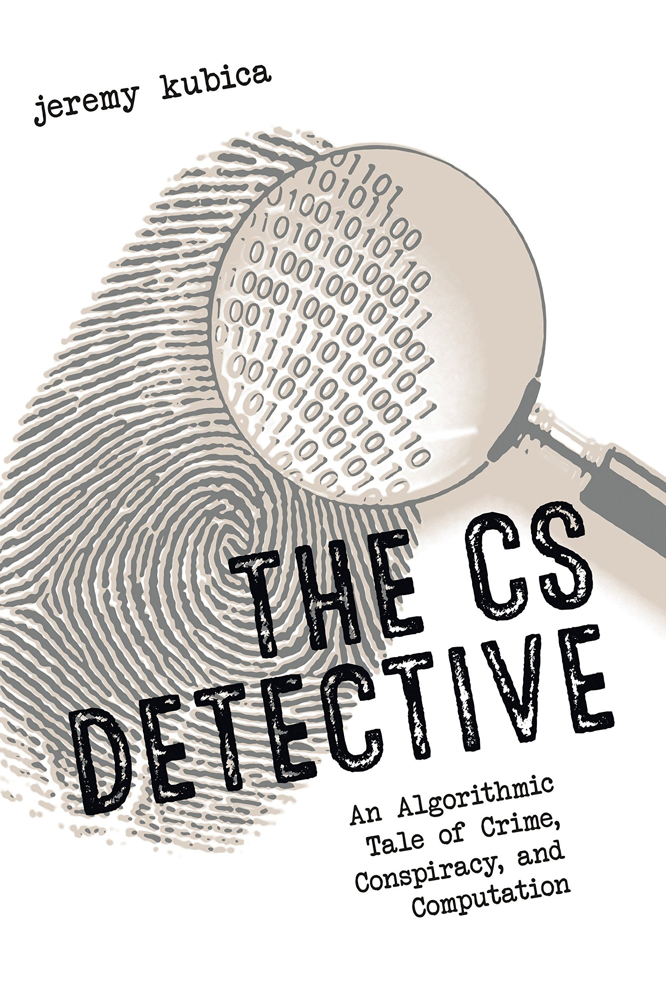
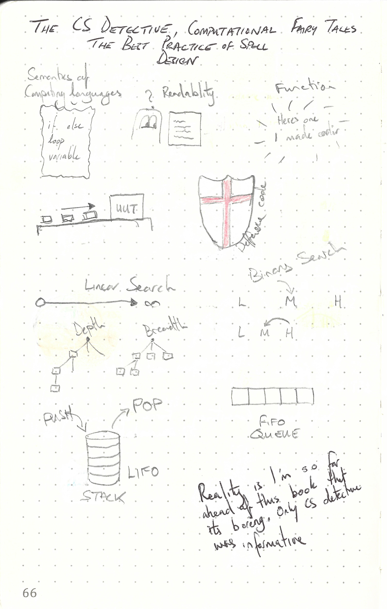

This repository is dedicated to

---

> The CS Detective; Best Practices of Spell Design; Computational Fairy Tales By Jeremy Kubica
>
> ISBN :- 978-1593277499 
> See author or others books
>
> First Edition

---

This book does not contain exercises, it is simply informative. Therefore a summary of what I thought relevant is given below. 

