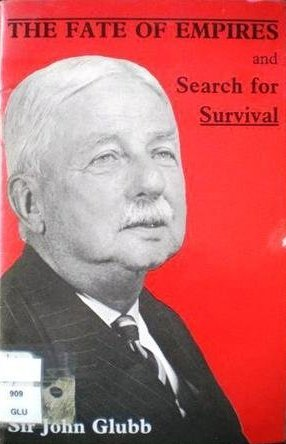

This repository is dedicated to

---

> The fate of empires and search for survival by Sir John Glubb
>
> ISBN :-  0-85158-127-7
>
> Available pdf from [Fate of Empires (uncw.edu)](http://people.uncw.edu/kozloffm/glubb.pdf)

---

The books "Table of Content"  represents the task list.

- [x] Introduction
- [x] The Fate of Empires
    - [x] Learning from history
    - [x] The lives of empires
    - [x] The human yardstick
    - [x] Stage one. The outburst
    - [x] Characteristics of the outburst
    - [x] The causes of race outbursts
    - [x] A providential turnover?
    - [x] The course of empire
    - [x] USA in the stage of pioneers
    - [x] Commercial expansion
    - [x] The pros and cons of empires
    - [x] Sea power
    - [x] The Age of Commerce
    - [x] Art and luxury
    - [x] The Age of Affluence
    - [x] High Noon
    - [x] Defensiveness
    - [x] The Age of Intellect
    - [x] The effects of intellectualism
    - [x] The inadequacy of intellect
    - [x] Civil dissensions
    - [x] The influx of foreigners
    - [x] Frivolity
    - [x] The Arab decline
    - [x] Political ideology
    - [x] The Mameluke Empire
    - [x] The master race
    - [x] The welfare state
    - [x] Religion
    - [x] New combinations
    - [x] Decadence of a system
    - [x] Decadence is not physical
    - [x] Human diversity
    - [x] A variety of falls
    - [x] Inadequacy of our historical studies
    - [x] Small nations
    - [x] The emerging pattern
    - [x] Would it help?
    - [x] Summary

This book does not contain exercises, it is simply informative. Therefore a summary of what I thought relevant is given below. 

