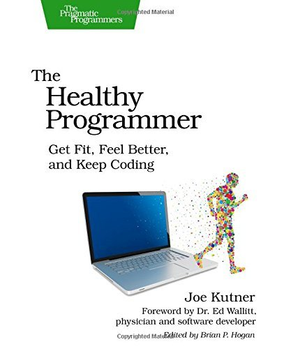
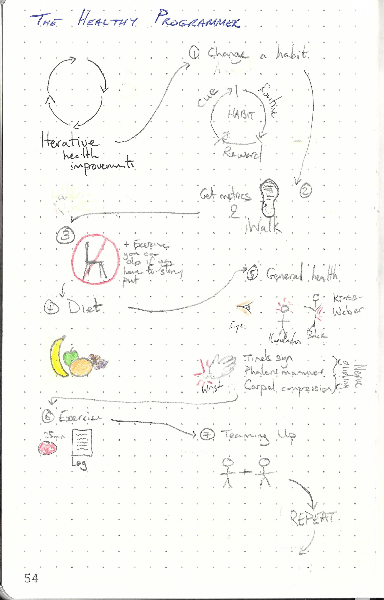

This repository is dedicated to

---

> The Healthy Programmer: Get Fit, Feel Better, and Keep Coding By Joe Jutner
>
> ISBN :- 978-1937785314
>
> First Edition

---

The books "Table of Content"  represents the task list.

- [x] Making Changes
- [x] Bootstrapping your Health
- [x] A Farewell to Chairs
- [x] Agile Dieting
- [x] Preventing Headaches and Eye Strain
- [x] Preventing Back Pain
- [x] Preventing Write Pain
- [x] Making Exercise Pragmatic
- [x] Thinking OUtside the Cube
- [x] Refactoring your Fitness
- [x] Teaning Up
- [x] Onwards, Healthy Programmer

This book does not contain exercises, it is simply informative. Therefore a summary of what I thought relevant is given below. 

