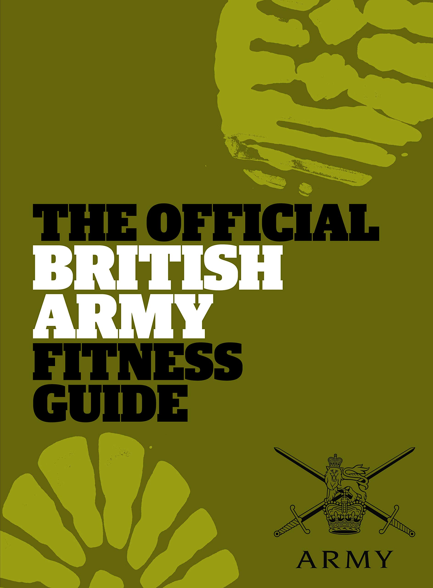
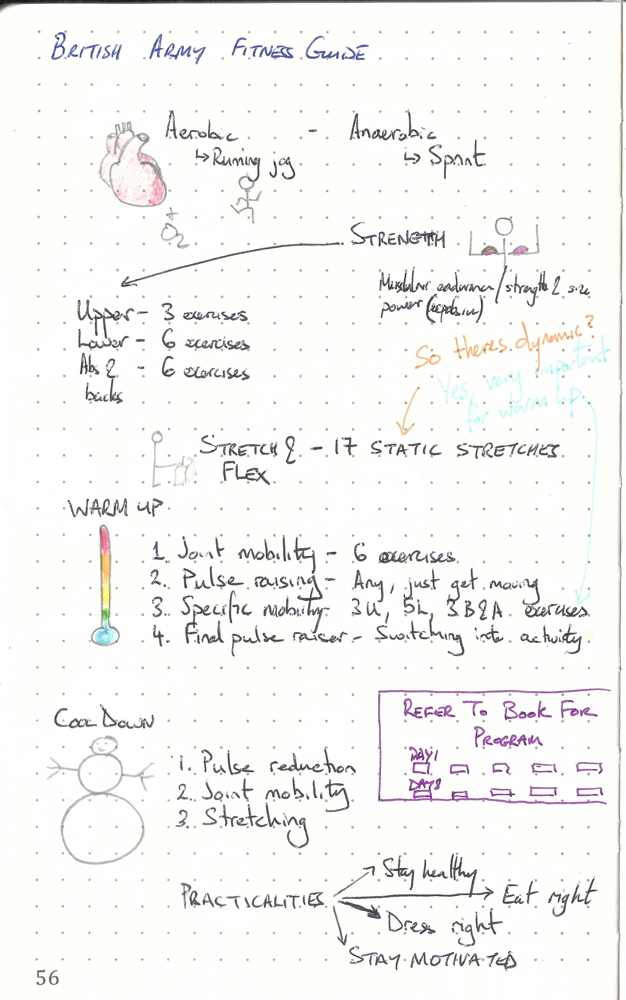

This repository is dedicated to

---

> The official British Army Fitness Guide By Sam Murphy
>
> ISBN :- 978-0-85265-118-6
>
> First Edition

---

The books "Table of Content"  represents the task list.

- [x] Part One: The Basics
    - [x] Aerobic fitness
    - [x] Strength
    - [x] Stretching and flexibility
    - [x] Warming up and colling down
- [x] Part Two: The Programmes
    - [x] Assessing your fitness level
    - [x] Which program is right for you?
    - [x] Exercise Programme Level One
    - [x] Exercise Programme Level Two
    - [x] Exercise Programme Level Three
- [x] Part Three: The Practicalities
    - [x] Staying healthy
    - [x] Nutrition and performance
    - [x] Clothing, footwear and equipment
    - [x] Staying motivated

This book does not contain exercises, it is simply informative. Therefore a summary of what I thought relevant is given below. 

