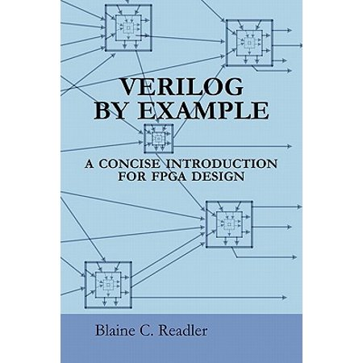

This repository is dedicated to the exercises of

---

Verilog by example. A concise introduction for FPGA design by Blaine C. Readler

ISBN 978-0-9834973-0-1

First Edition

---

The books "Table of Contents" represents the task list.

- [x] [Introduction](Summary.md)
- [x] [Tool Flow](Summary.md)
- [x] [In and Out](Summary.md)
- [x] [Clocks and Registers](Summary.md)
- [x] [State Machines](Summary.md)
- [x] [Modular Design](Summary.md)
- [x] [Memories](Summary.md)
- [x] [Managing Clocks](Summary.md)
- [x] [I/O Flavors](Summary.md)
- [x] [A Taste of Simulation](Summary.md)
- [x] [The Rest for Reference](Summary.md)
